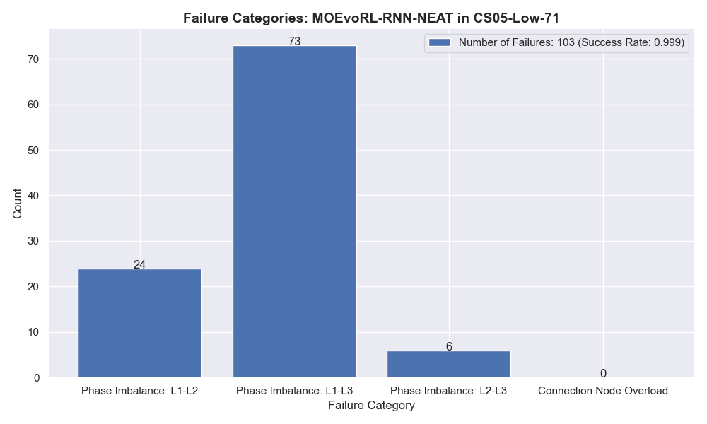
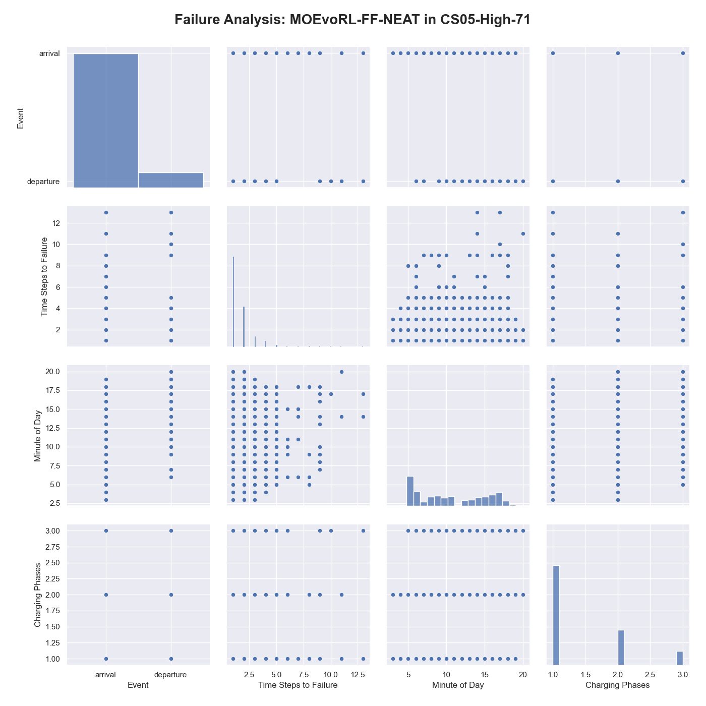
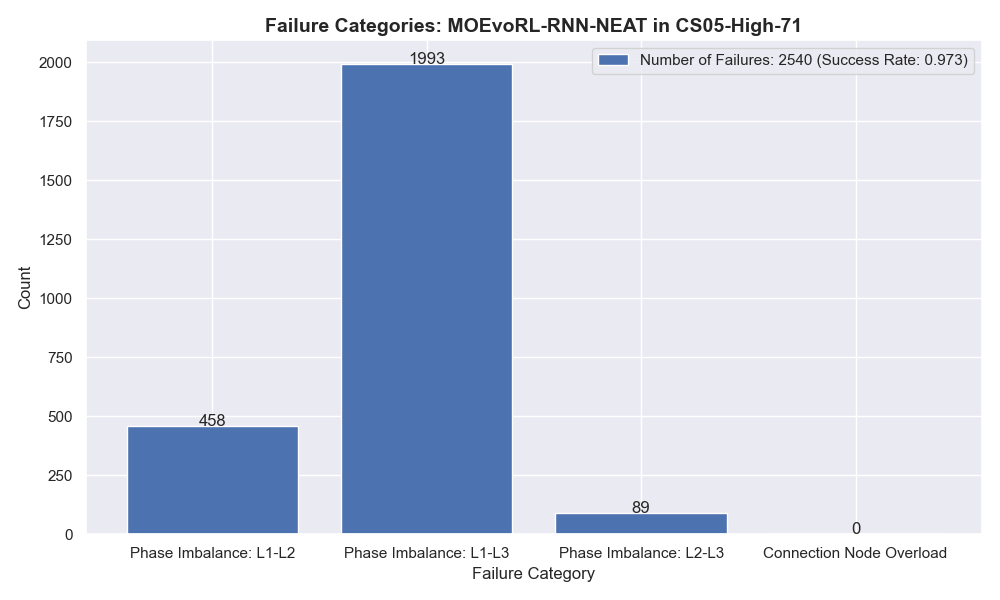
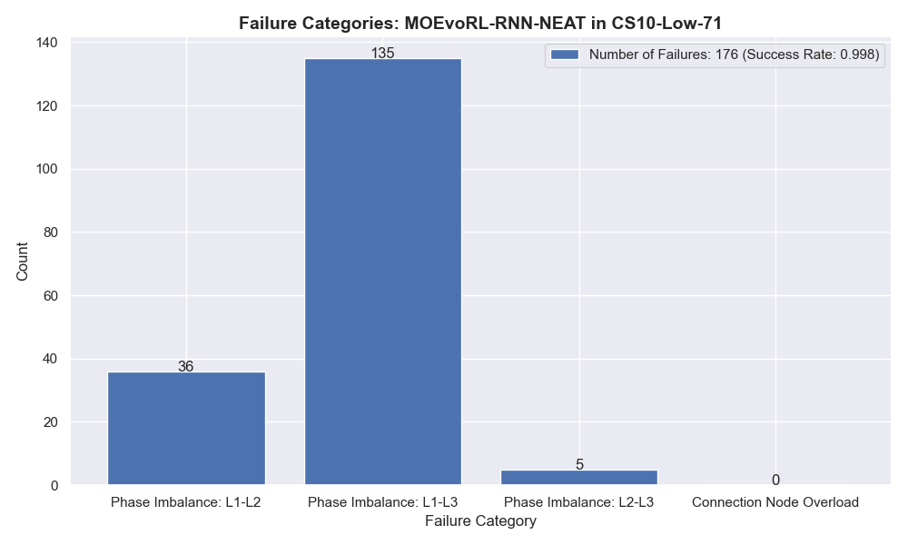

# Comparative Analysis of Multi-Objective and Evolutionary Reinforcement Learning Algorithms in Electric Vehicle Charging Management - Extended Appendix
## Appendix: Simulation
### PV Power Curve


*PV Power Curve: Hourly average power of the PV system over a recorded one-year period.*

## Appendix: Hyperparameter Optimization Results
Specific parameters for all agents are held constant, while others are subject to optimization. 
The values for these fixed parameters have been determined through previous manual random testing, ensuring a robust baseline for comparison. 
For the Multi-Objective Evolutionary Reinforcement Learning(MOEvoRL) models, parameters have been configured with a population size of 200 and a sigmoid activation function. 
The Multi-Objective Deep Deterministic Policy Gradient (MODDPG) models have a predefined network architecture consisting of three layers, each with 1024 units, both for the Actor and Critic networks. 
Adam optimizer is used for MODDPG optimization, with Relu as the activation function and Tanh for the output activation. 

| Parameter           | Distribution | Min         | Max         |
|---------------------|--------------|-------------|-------------|
| sbx_prob            | uniform      | 0.6         | 0.95        |
| mut_prob            | uniform      | 0.1         | 0.3         |
| sbx_eta             | int_uniform  | 3           | 30          |
| mut_eta             | int_uniform  | 3           | 30          |
| net_arch            | categorical  | [32, 32], [32, 32, 32], [32, 32, 32, 32] | - |
| batch_size          | categorical  | 8, 16, 32   | -           |
| env_iterations      | categorical  | 2, 5, 10    | -           |
| pop_size            | fixed        | 200         | -           |
| activation_function | fixed        | sigmoid     | -           |

*MOEvoRL-NSGA-II and MOEvoRL-SPEA2 Hyperparameter Search Space: The hyperparameter search space for the MOEvoRL-NSGA-II and MOEvoRL-SPEA2 agents.*

| Parameter                  | Distribution | Min   | Max   |
|----------------------------|--------------|-------|-------|
| conn_add_prob              | uniform      | 0.6   | 0.9   |
| conn_delete_prob           | uniform      | 0.1   | 0.4   |
| node_add_prob              | uniform      | 0.6   | 0.9   |
| node_delete_prob           | uniform      | 0.1   | 0.4   |
| survival_threshold         | uniform      | 0.1   | 0.3   |
| aggregation_mutate_rate    | uniform      | 0.1   | 0.3   |
| weight_mutate_rate         | uniform      | 0.6   | 0.9   |
| bias_mutate_rate           | uniform      | 0.6   | 0.9   |
| batch_size                 | categorical  | 8, 16, 32 | -    |
| env_iterations             | categorical  | 2, 5, 10  | -    |
| pop_size                   | fixed        | 200       | -    |
| activation_function        | fixed        | sigmoid   | -    |


*MOEvoRL-FF-NEAT and MOEvoRL-RNN-NEAT Hyperparameter Search Space: The hyperparameter search space for the MOEvoRL-FF-NEAT agents.*

| Parameter                    | Distribution | Min                   | Max                  |
|------------------------------|--------------|-----------------------|----------------------|
| gamma                        | uniform      | 0.95                  | 0.9999               |
| tau                          | uniform      | 0                     | 0.1                  |
| per_alpha                    | uniform      | 0.1                   | 1.0                  |
| learning_rate                | uniform      | \(1 \times 10^{-5}\)  | \(1 \times 10^{-4}\) |
| learning_starts              | int_uniform  | 1000                  | 10000                |
| policy_frequency             | int_uniform  | 1                     | 20                   |
| buffer_size                  | int_uniform  | \(1 \times 10^5\)     | \(2 \times 10^6\)    |
| batch_size                   | categorical  | 128, 256, 512         | -                    |
| net_arch                     | fixed        | [1024, 1024, 1024]    | -                    |
| activation_function          | fixed        | relu                  | -                    |
| output_activation_function   | fixed        | tanh                  | -                    |
| optimizer                    | fixed        | adam                  | -                    |

*MOODPG Hyperparameter Search Space: The hyperparameter search space for the MODDPG agents*

### MOEvoRL-NSGA-II Optimal Hyperparameters

| **Parameter**            | **Value**    |
|--------------------------|--------------|
| sbx_prob                 | 0.90         |
| mut_prob                 | 0.18         |
| sbx_eta                  | 23           |
| mut_eta                  | 22           |
| net_arch                 | [32, 32, 32] |
| batch_size               | 32           |
| env_iterations           | 10           |
| pop_size                 | 200          |
| activation_function      | sigmoid      |

*MOEvoRL-NSGA-II CS05-Med-42: Best hyperparameter parameter configuration.*


| **Parameter**            | **Value**    |
|--------------------------|--------------|
| sbx_prob                 | 0.75         |
| mut_prob                 | 0.26         |
| sbx_eta                  | 23           |
| mut_eta                  | 12           |
| net_arch                 | [32, 32, 32] |
| batch_size               | 16           |
| env_iterations           | 10           |
| pop_size                 | 200          |
| activation_function      | sigmoid      |

*MOEvoRL-NSGA-II CS05-Med-AR-42: Best hyperparameter parameter configuration.*


| **Parameter**            | **Value**    |
|--------------------------|--------------|
| sbx_prob                 | 0.83         |
| mut_prob                 | 0.29         |
| sbx_eta                  | 26           |
| mut_eta                  | 27           |
| net_arch                 | [32, 32, 32] |
| batch_size               | 16           |
| env_iterations           | 10           |
| pop_size                 | 200          |
| activation_function      | sigmoid      |

*MOEvoRL-NSGA-II CS10-Med-42: Best hyperparameter parameter configuration.*


| **Parameter**            | **Value**    |
|--------------------------|--------------|
| sbx_prob                 | 0.74         |
| mut_prob                 | 0.14         |
| sbx_eta                  | 19           |
| mut_eta                  | 15           |
| net_arch                 | [32, 32, 32] |
| batch_size               | 8           |
| env_iterations           | 10           |
| pop_size                 | 200          |
| activation_function      | sigmoid      |

*MOEvoRL-NSGA-II CS10-Med-AR-42: Best hyperparameter parameter configuration.*

| **Parameter**            | **Value**    |
|--------------------------|--------------|
| sbx_prob                 | 0.81         |
| mut_prob                 | 0.25         |
| sbx_eta                  | 10           |
| mut_eta                  | 25           |
| net_arch                 | [32, 32, 32] |
| batch_size               | 32           |
| env_iterations           | 10           |
| pop_size                 | 200          |
| activation_function      | sigmoid      |

*MOEvoRL-NSGA-II CS15-Med-42: Best hyperparameter parameter configuration.*

| **Parameter**            | **Value**    |
|--------------------------|--------------|
| sbx_prob                 | 0.89         |
| mut_prob                 | 0.28         |
| sbx_eta                  | 27           |
| mut_eta                  | 28           |
| net_arch                 | [32, 32, 32] |
| batch_size               | 32           |
| env_iterations           | 5           |
| pop_size                 | 200          |
| activation_function      | sigmoid      |

*MOEvoRL-NSGA-II CS15-Med-AR-42: Best hyperparameter parameter configuration.*


### MOEvoRL-SPEA2 Optimal Hyperparameters

| **Parameter**            | **Value**    |
|--------------------------|--------------|
| sbx_prob                 | 0.88         |
| mut_prob                 | 0.21        |
| sbx_eta                  | 16           |
| mut_eta                  | 24           |
| net_arch                 | [32, 32, 32] |
| batch_size               | 32           |
| env_iterations           | 10           |
| pop_size                 | 200          |
| activation_function      | sigmoid      |

*MOEvoRL-SPEA2 CS05-Med-42: Best hyperparameter parameter configuration.*

| **Parameter**            | **Value**    |
|--------------------------|--------------|
| sbx_prob                 | 0.76         |
| mut_prob                 | 0.20        |
| sbx_eta                  | 16           |
| mut_eta                  | 12           |
| net_arch                 | [32, 32, 32, 32] |
| batch_size               | 16           |
| env_iterations           | 10           |
| pop_size                 | 200          |
| activation_function      | sigmoid      |

*MOEvoRL-SPEA2 CS05-Med-AR-42: Best hyperparameter parameter configuration.*


| **Parameter**            | **Value**    |
|--------------------------|--------------|
| sbx_prob                 | 0.82         |
| mut_prob                 | 0.28        |
| sbx_eta                  | 14           |
| mut_eta                  | 8           |
| net_arch                 | [32, 32, 32] |
| batch_size               | 32           |
| env_iterations           | 10           |
| pop_size                 | 200          |
| activation_function      | sigmoid      |

*MOEvoRL-SPEA2 CS10-Med-42: Best hyperparameter parameter configuration.*


| **Parameter**            | **Value**    |
|--------------------------|--------------|
| sbx_prob                 | 0.85         |
| mut_prob                 | 0.22        |
| sbx_eta                  | 18           |
| mut_eta                  | 13           |
| net_arch                 | [32, 32, 32, 32] |
| batch_size               | 16           |
| env_iterations           | 10           |
| pop_size                 | 200          |
| activation_function      | sigmoid      |

*MOEvoRL-SPEA2 CS10-Med-AR-42: Best hyperparameter parameter configuration.*

| **Parameter**            | **Value**    |
|--------------------------|--------------|
| sbx_prob                 | 0.92         |
| mut_prob                 | 0.29        |
| sbx_eta                  | 20           |
| mut_eta                  | 29           |
| net_arch                 | [32, 32, 32] |
| batch_size               | 32           |
| env_iterations           | 10           |
| pop_size                 | 200          |
| activation_function      | sigmoid      |

*MOEvoRL-SPEA2 CS15-Med-42: Best hyperparameter parameter configuration.*


| **Parameter**            | **Value**    |
|--------------------------|--------------|
| sbx_prob                 | 0.95         |
| mut_prob                 | 0.18        |
| sbx_eta                  | 15           |
| mut_eta                  | 12           |
| net_arch                 | [32, 32, 32] |
| batch_size               | 32           |
| env_iterations           | 5           |
| pop_size                 | 200          |
| activation_function      | sigmoid      |

*MOEvoRL-SPEA2 CS15-Med-AR-42: Best hyperparameter parameter configuration.*


### MOEvoRL-FF-NEAT Optimal Hyperparameters

| **Parameter**                | **Value** |
|------------------------------|-----------|
| conn_add_prob                | 0.72      |
| conn_delete_prob             | 0.25      |
| node_add_prob                | 0.60      |
| node_delete_prob             | 0.28      |
| survival_threshold           | 0.20      |
| aggregation_mutate_rate      | 0.22      |
| weight_mutate_rate           | 0.89      |
| bias_mutate_rate             | 0.64      |
| batch_size                   | 32        |
| env_iterations               | 10        |
| pop_size                     | 200       |
| activation_function          | sigmoid   |

*MOEvoRL-FF-NEAT CS05-Med-42: Best hyperparameter parameter configuration.*


| **Parameter**                | **Value** |
|------------------------------|-----------|
| conn_add_prob                | 0.73      |
| conn_delete_prob             | 0.39      |
| node_add_prob                | 0.79      |
| node_delete_prob             | 0.32      |
| survival_threshold           | 0.12      |
| aggregation_mutate_rate      | 0.20      |
| weight_mutate_rate           | 0.71      |
| bias_mutate_rate             | 0.79      |
| batch_size                   | 8        |
| env_iterations               | 2        |
| pop_size                     | 200       |
| activation_function          | sigmoid   |

*MOEvoRL-FF-NEAT CS05-Med-AR-42: Best hyperparameter parameter configuration.*


| **Parameter**                | **Value** |
|------------------------------|-----------|
| conn_add_prob                | 0.79      |
| conn_delete_prob             | 0.33      |
| node_add_prob                | 0.70      |
| node_delete_prob             | 0.28      |
| survival_threshold           | 0.16      |
| aggregation_mutate_rate      | 0.26      |
| weight_mutate_rate           | 0.65      |
| bias_mutate_rate             | 0.66      |
| batch_size                   | 16        |
| env_iterations               | 10        |
| pop_size                     | 200       |
| activation_function          | sigmoid   |

*MOEvoRL-FF-NEAT CS10-Med-42: Best hyperparameter parameter configuration.*


| **Parameter**                | **Value** |
|------------------------------|-----------|
| conn_add_prob                | 0.82      |
| conn_delete_prob             | 0.18      |
| node_add_prob                | 0.67      |
| node_delete_prob             | 0.31      |
| survival_threshold           | 0.23      |
| aggregation_mutate_rate      | 0.26      |
| weight_mutate_rate           | 0.74      |
| bias_mutate_rate             | 0.84      |
| batch_size                   | 16        |
| env_iterations               | 10        |
| pop_size                     | 200       |
| activation_function          | sigmoid   |

*MOEvoRL-FF-NEAT CS10-Med-AR-42: Best hyperparameter parameter configuration.*

| **Parameter**                | **Value** |
|------------------------------|-----------|
| conn_add_prob                | 0.73      |
| conn_delete_prob             | 0.13      |
| node_add_prob                | 0.80      |
| node_delete_prob             | 0.33      |
| survival_threshold           | 0.18      |
| aggregation_mutate_rate      | 0.16      |
| weight_mutate_rate           | 0.63      |
| bias_mutate_rate             | 0.81      |
| batch_size                   | 32        |
| env_iterations               | 10        |
| pop_size                     | 200       |
| activation_function          | sigmoid   |

*MOEvoRL-FF-NEAT CS15-Med-42: Best hyperparameter parameter configuration.*


| **Parameter**                | **Value** |
|------------------------------|-----------|
| conn_add_prob                | 0.70      |
| conn_delete_prob             | 0.36      |
| node_add_prob                | 0.61      |
| node_delete_prob             | 0.34      |
| survival_threshold           | 0.10      |
| aggregation_mutate_rate      | 0.24      |
| weight_mutate_rate           | 0.88      |
| bias_mutate_rate             | 0.71      |
| batch_size                   | 32        |
| env_iterations               | 10        |
| pop_size                     | 200       |
| activation_function          | sigmoid   |

*MOEvoRL-FF-NEAT CS15-Med-AR-42: Best hyperparameter parameter configuration.*


### MOEvoRL-RNN-NEAT Optimal Hyperparameters

| **Parameter**                | **Value** |
|------------------------------|-----------|
| conn_add_prob                | 0.72      |
| conn_delete_prob             | 0.35      |
| node_add_prob                | 0.66      |
| node_delete_prob             | 0.16      |
| survival_threshold           | 0.17      |
| aggregation_mutate_rate      | 0.24      |
| weight_mutate_rate           | 0.81      |
| bias_mutate_rate             | 0.78      |
| batch_size                   | 32        |
| env_iterations               | 5        |
| pop_size                     | 200       |
| activation_function          | sigmoid   |

*MOEvoRL-RNN-NEAT CS05-Med-42: Best hyperparameter parameter configuration.*


| **Parameter**                | **Value** |
|------------------------------|-----------|
| conn_add_prob                | 0.83      |
| conn_delete_prob             | 0.39      |
| node_add_prob                | 0.84      |
| node_delete_prob             | 0.39      |
| survival_threshold           | 0.27      |
| aggregation_mutate_rate      | 0.23      |
| weight_mutate_rate           | 0.87      |
| bias_mutate_rate             | 0.85      |
| batch_size                   | 8        |
| env_iterations               | 5        |
| pop_size                     | 200       |
| activation_function          | sigmoid   |

*MOEvoRL-RNN-NEAT CS05-Med-AR-42: Best hyperparameter parameter configuration.*


| **Parameter**                | **Value** |
|------------------------------|-----------|
| conn_add_prob                | 0.76      |
| conn_delete_prob             | 0.24      |
| node_add_prob                | 0.77      |
| node_delete_prob             | 0.25      |
| survival_threshold           | 0.21      |
| aggregation_mutate_rate      | 0.29      |
| weight_mutate_rate           | 0.85      |
| bias_mutate_rate             | 0.66      |
| batch_size                   | 32        |
| env_iterations               | 10        |
| pop_size                     | 200       |
| activation_function          | sigmoid   |

*MOEvoRL-RNN-NEAT CS10-Med-42: Best hyperparameter parameter configuration.*


| **Parameter**                | **Value** |
|------------------------------|-----------|
| conn_add_prob                | 0.75      |
| conn_delete_prob             | 0.15      |
| node_add_prob                | 0.75      |
| node_delete_prob             | 0.20      |
| survival_threshold           | 0.23      |
| aggregation_mutate_rate      | 0.24      |
| weight_mutate_rate           | 0.80      |
| bias_mutate_rate             | 0.67      |
| batch_size                   | 32        |
| env_iterations               | 10        |
| pop_size                     | 200       |
| activation_function          | sigmoid   |

*MOEvoRL-RNN-NEAT CS10-Med-AR-42: Best hyperparameter parameter configuration.*

| **Parameter**                | **Value** |
|------------------------------|-----------|
| conn_add_prob                | 0.78      |
| conn_delete_prob             | 0.24      |
| node_add_prob                | 0.69      |
| node_delete_prob             | 0.13      |
| survival_threshold           | 0.28      |
| aggregation_mutate_rate      | 0.12      |
| weight_mutate_rate           | 0.83      |
| bias_mutate_rate             | 0.78      |
| batch_size                   | 8         |
| env_iterations               | 2         |
| pop_size                     | 200       |
| activation_function          | sigmoid   |

*MOEvoRL-RNN-NEAT CS15-Med-42: Best hyperparameter parameter configuration.*


| **Parameter**                | **Value** |
|------------------------------|-----------|
| conn_add_prob                | 0.73      |
| conn_delete_prob             | 0.35      |
| node_add_prob                | 0.65      |
| node_delete_prob             | 0.33      |
| survival_threshold           | 0.18      |
| aggregation_mutate_rate      | 0.29      |
| weight_mutate_rate           | 0.71      |
| bias_mutate_rate             | 0.67      |
| batch_size                   | 8         |
| env_iterations               | 2         |
| pop_size                     | 200       |
| activation_function          | sigmoid   |

*MOEvoRL-RNN-NEAT CS15-Med-AR-42: Best hyperparameter parameter configuration.*


### MODDPG Optimal Hyperparameters
| **Parameter**                   | **Value**             |
|---------------------------------|-----------------------|
| gamma                           | 0.99                  |
| tau                             | 0.04                  |
| per_alpha                       | 0.71                  |
| learning_rate                   | 1.1 x 10^{-5}         |
| learning_starts                 | 7500                  |
| policy_frequency                | 13                    |
| buffer_size                     | $1 x 10^6$            |
| batch_size                      | 256                   |
| net_arch                        | [1024, 1024, 1024]    |
| activation_function             | relu                  |
| output_activation_function      | tanh                  |
| optimizer                       | adam                  |

*MODDPG CS05-Med-42: Best hyperparameter parameter configuration.*


| **Parameter**                   | **Value**             |
|---------------------------------|-----------------------|
| gamma                           | 0.99                  |
| tau                             | 0.09                  |
| per_alpha                       | 0.60                  |
| learning_rate                   | 1.8 x 10^{-5}         |
| learning_starts                 | 1500                  |
| policy_frequency                | 6                    |
| buffer_size                     | $1 x 10^6$            |
| batch_size                      | 256                   |
| net_arch                        | [1024, 1024, 1024]    |
| activation_function             | relu                  |
| output_activation_function      | tanh                  |
| optimizer                       | adam                  |

*MODDPG CS05-Med-AR-42: Best hyperparameter parameter configuration.*


| **Parameter**                   | **Value**             |
|---------------------------------|-----------------------|
| gamma                           | 0.99                  |
| tau                             | 0.02                  |
| per_alpha                       | 0.65                  |
| learning_rate                   | 6.2 x 10^{-5}         |
| learning_starts                 | 9100                  |
| policy_frequency                | 6                    |
| buffer_size                     | $1 x 10^6$            |
| batch_size                      | 512                   |
| net_arch                        | [1024, 1024, 1024]    |
| activation_function             | relu                  |
| output_activation_function      | tanh                  |
| optimizer                       | adam                  |

*MODDPG CS10-Med-42: Best hyperparameter parameter configuration.*


| **Parameter**                   | **Value**             |
|---------------------------------|-----------------------|
| gamma                           | 0.99                  |
| tau                             | 0.04                  |
| per_alpha                       | 0.80                  |
| learning_rate                   | 8.6 x 10^{-5}         |
| learning_starts                 | 5600                  |
| policy_frequency                | 16                    |
| buffer_size                     | $1 x 10^6$            |
| batch_size                      | 128                   |
| net_arch                        | [1024, 1024, 1024]    |
| activation_function             | relu                  |
| output_activation_function      | tanh                  |
| optimizer                       | adam                  |

*MODDPG CS10-Med-AR-42: Best hyperparameter parameter configuration.*

| **Parameter**                   | **Value**             |
|---------------------------------|-----------------------|
| gamma                           | 0.99                  |
| tau                             | 0.03                  |
| per_alpha                       | 0.77                  |
| learning_rate                   | 4.5 x 10^{-5}         |
| learning_starts                 | 2000                  |
| policy_frequency                | 19                    |
| buffer_size                     | $1 x 10^6$            |
| batch_size                      | 512                   |
| net_arch                        | [1024, 1024, 1024]    |
| activation_function             | relu                  |
| output_activation_function      | tanh                  |
| optimizer                       | adam                  |

*MODDPG CS15-Med-42: Best hyperparameter parameter configuration.*


| **Parameter**                   | **Value**             |
|---------------------------------|-----------------------|
| gamma                           | 0.99                  |
| tau                             | 0.02                  |
| per_alpha                       | 0.84                  |
| learning_rate                   | 1.6 x 10^{-5}         |
| learning_starts                 | 1700                  |
| policy_frequency                | 1                    |
| buffer_size                     | $1.5 x 10^6$            |
| batch_size                      | 128                   |
| net_arch                        | [1024, 1024, 1024]    |
| activation_function             | relu                  |
| output_activation_function      | tanh                  |
| optimizer                       | adam                  |


## Appendix: Anaylsis of Charging Events
### CS05 Charging Events


*Arrival and Charging Patterns for CS05-Med-42*


*Arrival and Charging Patterns for CS05-Low-71*


*Arrival and Charging Patterns for CS05-Med-71*


*Arrival and Charging Patterns for CS05-High-71*


*EV Model Distribution in CS05-Med-42*


*EV Model Distribution in CS05-Low-71*


*EV Model Distribution in CS05-Med-71*


*EV Model Distribution in CS05-High-71*

### CS10 Charging Events


*Arrival and Charging Patterns for CS10-Med-42*


*Arrival and Charging Patterns for CS10-Low-71*


*Arrival and Charging Patterns for CS10-Med-71*


*Arrival and Charging Patterns for CS10-High-71*


*EV Model Distribution in CS10-Med-42*


*EV Model Distribution in CS10-Low-71*


*EV Model Distribution in CS10-Med-71*


*EV Model Distribution in CS10-High-71*


### CS15 Charging Events


*Arrival and Charging Patterns for CS15-Med-42*


*Arrival and Charging Patterns for CS15-Low-71*


*Arrival and Charging Patterns for CS15-Med-71*


*Arrival and Charging Patterns for CS15-High-71*


*EV Model Distribution in CS15-Med-42*


*EV Model Distribution in CS15-Low-71*


*EV Model Distribution in CS15-Med-71*


*EV Model Distribution in CS15-High-71*

## Appendix: Comparative Analysis of Training Dynamics
### CS05-Med-42 Training Performance


*R0 Comparison CS05-Med-42: Diagram provides a comparative analysis of the convergence behavior of five models in scenario CS05-Med-42, focusing on the reward R0 throughout the training episodes.*


*R1 Comparison CS05-Med-42: Diagram provides a comparative analysis of the convergence behavior of five models in scenario CS05-Med-42, focusing on the reward R1 throughout the training episodes.*


*R2 Comparison CS05-Med-42: Diagram provides a comparative analysis of the convergence behavior of five models in scenario CS05-Med-42, focusing on the reward R2 throughout the training episodes.*


*Success Rate Comparison CS05-Med-42: Diagram provides a comparative analysis of the convergence behavior of five models in scenario CS05-Med-42, focusing on the Success Rate throughout the training episodes.*


*Hypervolume Comparison CS05-Med-42: Diagram provides a comparative analysis of the convergence behavior of five models in scenario CS05-Med-42, focusing on the HV throughout the training episodes.*


### CS05-Med-AR-42 Training Performance


*R0 Comparison CS05-Med-AR-42: Diagram provides a comparative analysis of the convergence behavior of five models in scenario CS05-Med-AR-42, focusing on the reward R0 throughout the training episodes.*


*R1 Comparison CS05-Med-AR-42: Diagram provides a comparative analysis of the convergence behavior of five models in scenario CS05-Med-AR-42, focusing on the reward R1 throughout the training episodes.*


*R2 Comparison CS05-Med-AR-42: Diagram provides a comparative analysis of the convergence behavior of five models in scenario CS05-Med-AR-42, focusing on the reward R2 throughout the training episodes.*


*Hypervolume Comparison CS05-Med-AR-42: Diagram provides a comparative analysis of the convergence behavior of five models in scenario CS05-Med-AR-42, focusing on the HV throughout the training episodes.*


### CS10-Med-42 Training Performance


*R0 Comparison CS10-Med-42: Diagram provides a comparative analysis of the convergence behavior of five models in scenario CS10-Med-42, focusing on the reward R0 throughout the training episodes.*


*R1 Comparison CS10-Med-42: Diagram provides a comparative analysis of the convergence behavior of five models in scenario CS10-Med-42, focusing on the reward R1 throughout the training episodes.*


*R2 Comparison CS10-Med-42: Diagram provides a comparative analysis of the convergence behavior of five models in scenario CS10-Med-42, focusing on the reward R2 throughout the training episodes.*


*Success Rate Comparison CS10-Med-42: Diagram provides a comparative analysis of the convergence behavior of five models in scenario CS10-Med-42, focusing on the Success Rate throughout the training episodes.*


*Hypervolume Comparison CS10-Med-42: Diagram provides a comparative analysis of the convergence behavior of five models in scenario CS10-Med-42, focusing on the HV throughout the training episodes.*


### CS10-Med-AR-42 Training Performance


*R0 Comparison CS10-Med-AR-42: Diagram provides a comparative analysis of the convergence behavior of five models in scenario CS10-Med-AR-42, focusing on the reward R0 throughout the training episodes.*


*R1 Comparison CS10-Med-AR-42: Diagram provides a comparative analysis of the convergence behavior of five models in scenario CS10-Med-AR-42, focusing on the reward R1 throughout the training episodes.*


*R2 Comparison CS10-Med-AR-42: Diagram provides a comparative analysis of the convergence behavior of five models in scenario CS10-Med-AR-42, focusing on the reward R2 throughout the training episodes.*


*Hypervolume Comparison CS10-Med-AR-42: Diagram provides a comparative analysis of the convergence behavior of five models in scenario CS10-Med-AR-42, focusing on the HV throughout the training episodes.*


### CS15-Med-42 Training Performance


*R0 Comparison CS15-Med-42: Diagram provides a comparative analysis of the convergence behavior of five models in scenario CS15-Med-42, focusing on the reward R0 throughout the training episodes.*


*R1 Comparison CS15-Med-42: Diagram provides a comparative analysis of the convergence behavior of five models in scenario CS15-Med-42, focusing on the reward R1 throughout the training episodes.*


*R2 Comparison CS15-Med-42: Diagram provides a comparative analysis of the convergence behavior of five models in scenario CS15-Med-42, focusing on the reward R2 throughout the training episodes.*


*Success Rate Comparison CS15-Med-42: Diagram provides a comparative analysis of the convergence behavior of five models in scenario CS15-Med-42, focusing on the Success Rate throughout the training episodes.*


*Hypervolume Comparison CS15-Med-42: Diagram provides a comparative analysis of the convergence behavior of five models in scenario CS15-Med-42, focusing on the HV throughout the training episodes.*


### CS15-Med-AR-42 Training Performance


*R0 Comparison CS15-Med-AR-42: Diagram provides a comparative analysis of the convergence behavior of five models in scenario CS15-Med-AR-42, focusing on the reward R0 throughout the training episodes.*


*R1 Comparison CS15-Med-AR-42: Diagram provides a comparative analysis of the convergence behavior of five models in scenario CS15-Med-AR-42, focusing on the reward R1 throughout the training episodes.*


*R2 Comparison CS15-Med-AR-42: Diagram provides a comparative analysis of the convergence behavior of five models in scenario CS15-Med-AR-42, focusing on the reward R2 throughout the training episodes.*


*Hypervolume Comparison CS15-Med-AR-42: Diagram provides a comparative analysis of the convergence behavior of five models in scenario CS15-Med-AR-42, focusing on the HV throughout the training episodes.*


## Appendix: Comparative Analysis of Failures
### CS05-Low-71 Failure Analysis


*Failure Classification CS05-Low-71 MOEvoRL-NSGA-II: Bar chart depicting the distribution of the three failure categories Phase Imbalance L1-L2, L1-L3, L2-L3 and Connection Node Overload for the MOEvoRL-NSGA-II algorithm in CS05-Low-71.*


*Failure Analysis CS05-Low-71 MOEvoRL-NSGA-II: Comprehensive failure analysis of the MOEvoRL-NSGA-II algorithm in CS05-Low-71.*


*Failure Classification CS05-Low-71 MOEvoRL-SPEA2: Bar chart depicting the distribution of the three failure categories Phase Imbalance L1-L2, L1-L3, L2-L3 and Connection Node Overload for the MOEvoRL-SPEA2 algorithm in CS05-Low-71.*


*Failure Analysis CS05-Low-71 MOEvoRL-SPEA2: Comprehensive failure analysis of the MOEvoRL-SPEA2 algorithm in CS05-Low-71.*


*Failure Classification CS05-Low-71 MOEvoRL-FF-NEAT: Bar chart depicting the distribution of the three failure categories Phase Imbalance L1-L2, L1-L3, L2-L3 and Connection Node Overload for the MOEvoRL-FF-NEAT algorithm in CS05-Low-71.*


*Failure Analysis CS05-Low-71 MOEvoRL-FF-NEAT: Comprehensive failure analysis of the MOEvoRL-FF-NEAT algorithm in CS05-Low-71.*



*Failure Classification CS05-Low-71 MOEvoRL-RNN-NEAT: Bar chart depicting the distribution of the three failure categories Phase Imbalance L1-L2, L1-L3, L2-L3 and Connection Node Overload for the MOEvoRL-RNN-NEAT algorithm in CS05-Low-71.*


*Failure Analysis CS05-Low-71 MOEvoRL-RNN-NEAT: Comprehensive failure analysis of the MOEvoRL-RNN-NEAT algorithm in CS05-Low-71.*


*Failure Classification CS05-Low-71 MODDPG: Bar chart depicting the distribution of the three failure categories Phase Imbalance L1-L2, L1-L3, L2-L3 and Connection Node Overload for the MODDPG algorithm in CS05-Low-71.*


*Failure Analysis CS05-Low-71 MODDPG: Comprehensive failure analysis of the MODDPG algorithm in CS05-Low-71.*

### CS05-Med-71 Failure Analysis


*Failure Classification CS05-Med-71 MOEvoRL-NSGA-II: Bar chart depicting the distribution of the three failure categories Phase Imbalance L1-L2, L1-L3, L2-L3 and Connection Node Overload for the MOEvoRL-NSGA-II algorithm in CS05-Med-71.*


*Failure Analysis CS05-Med-71 MOEvoRL-NSGA-II: Comprehensive failure analysis of the MOEvoRL-NSGA-II algorithm in CS05-Med-71.*


*Failure Classification CS05-Med-71 MOEvoRL-SPEA2: Bar chart depicting the distribution of the three failure categories Phase Imbalance L1-L2, L1-L3, L2-L3 and Connection Node Overload for the MOEvoRL-SPEA2 algorithm in CS05-Med-71.*


*Failure Analysis CS05-Med-71 MOEvoRL-SPEA2: Comprehensive failure analysis of the MOEvoRL-SPEA2 algorithm in CS05-Med-71.*


*Failure Classification CS05-Med-71 MOEvoRL-FF-NEAT: Bar chart depicting the distribution of the three failure categories Phase Imbalance L1-L2, L1-L3, L2-L3 and Connection Node Overload for the MOEvoRL-FF-NEAT algorithm in CS05-Med-71.*


*Failure Analysis CS05-Med-71 MOEvoRL-FF-NEAT: Comprehensive failure analysis of the MOEvoRL-FF-NEAT algorithm in CS05-Med-71.*


*Failure Classification CS05-Med-71 MOEvoRL-RNN-NEAT: Bar chart depicting the distribution of the three failure categories Phase Imbalance L1-L2, L1-L3, L2-L3 and Connection Node Overload for the MOEvoRL-RNN-NEAT algorithm in CS05-Med-71.*


*Failure Analysis CS05-Med-71 MOEvoRL-RNN-NEAT: Comprehensive failure analysis of the MOEvoRL-RNN-NEAT algorithm in CS05-Med-71.*


*Failure Classification CS05-Med-71 MODDPG: Bar chart depicting the distribution of the three failure categories Phase Imbalance L1-L2, L1-L3, L2-L3 and Connection Node Overload for the MODDPG algorithm in CS05-Med-71.*


*Failure Analysis CS05-Med-71 MODDPG: Comprehensive failure analysis of the MODDPG algorithm in CS05-Med-71.*

### CS05-High-71 Failure Analysis


*Failure Classification CS05-High-71 MOEvoRL-NSGA-II: Bar chart depicting the distribution of the three failure categories Phase Imbalance L1-L2, L1-L3, L2-L3 and Connection Node Overload for the MOEvoRL-NSGA-II algorithm in CS05-High-71.*


*Failure Analysis CS05-High-71 MOEvoRL-NSGA-II: Comprehensive failure analysis of the MOEvoRL-NSGA-II algorithm in CS05-High-71.*


*Failure Classification CS05-High-71 MOEvoRL-SPEA2: Bar chart depicting the distribution of the three failure categories Phase Imbalance L1-L2, L1-L3, L2-L3 and Connection Node Overload for the MOEvoRL-SPEA2 algorithm in CS05-High-71.*


*Failure Analysis CS05-High-71 MOEvoRL-SPEA2: Comprehensive failure analysis of the MOEvoRL-SPEA2 algorithm in CS05-High-71.*


*Failure Classification CS05-High-71 MOEvoRL-FF-NEAT: Bar chart depicting the distribution of the three failure categories Phase Imbalance L1-L2, L1-L3, L2-L3 and Connection Node Overload for the MOEvoRL-FF-NEAT algorithm in CS05-High-71.*



*Failure Analysis CS05-High-71 MOEvoRL-FF-NEAT: Comprehensive failure analysis of the MOEvoRL-FF-NEAT algorithm in CS05-High-71.*



*Failure Classification CS05-High-71 MOEvoRL-RNN-NEAT: Bar chart depicting the distribution of the three failure categories Phase Imbalance L1-L2, L1-L3, L2-L3 and Connection Node Overload for the MOEvoRL-RNN-NEAT algorithm in CS05-High-71.*


*Failure Analysis CS05-High-71 MOEvoRL-RNN-NEAT: Comprehensive failure analysis of the MOEvoRL-RNN-NEAT algorithm in CS05-High-71.*


*Failure Classification CS05-High-71 MODDPG: Bar chart depicting the distribution of the three failure categories Phase Imbalance L1-L2, L1-L3, L2-L3 and Connection Node Overload for the MODDPG algorithm in CS05-High-71.*


*Failure Analysis CS05-High-71 MODDPG: Comprehensive failure analysis of the MODDPG algorithm in CS05-High-71.*

### CS10-Low-71 Failure Analysis


*Failure Classification CS10-Low-71 MOEvoRL-NSGA-II: Bar chart depicting the distribution of the three failure categories Phase Imbalance L1-L2, L1-L3, L2-L3 and Connection Node Overload for the MOEvoRL-NSGA-II algorithm in CS10-Low-71.*


*Failure Analysis CS10-Low-71 MOEvoRL-NSGA-II: Comprehensive failure analysis of the MOEvoRL-NSGA-II algorithm in CS10-Low-71.*


*Failure Classification CS10-Low-71 MOEvoRL-SPEA2: Bar chart depicting the distribution of the three failure categories Phase Imbalance L1-L2, L1-L3, L2-L3 and Connection Node Overload for the MOEvoRL-SPEA2 algorithm in CS10-Low-71.*


*Failure Analysis CS10-Low-71 MOEvoRL-SPEA2: Comprehensive failure analysis of the MOEvoRL-SPEA2 algorithm in CS10-Low-71.*


*Failure Classification CS10-Low-71 MOEvoRL-FF-NEAT: Bar chart depicting the distribution of the three failure categories Phase Imbalance L1-L2, L1-L3, L2-L3 and Connection Node Overload for the MOEvoRL-FF-NEAT algorithm in CS10-Low-71.*


*Failure Analysis CS10-Low-71 MOEvoRL-FF-NEAT: Comprehensive failure analysis of the MOEvoRL-FF-NEAT algorithm in CS10-Low-71.*



*Failure Classification CS10-Low-71 MOEvoRL-RNN-NEAT: Bar chart depicting the distribution of the three failure categories Phase Imbalance L1-L2, L1-L3, L2-L3 and Connection Node Overload for the MOEvoRL-RNN-NEAT algorithm in CS10-Low-71.*


*Failure Analysis CS10-Low-71 MOEvoRL-RNN-NEAT: Comprehensive failure analysis of the MOEvoRL-RNN-NEAT algorithm in CS10-Low-71.*


*Failure Classification CS10-Low-71 MODDPG: Bar chart depicting the distribution of the three failure categories Phase Imbalance L1-L2, L1-L3, L2-L3 and Connection Node Overload for the MODDPG algorithm in CS10-Low-71.*


*Failure Analysis CS10-Low-71 MODDPG: Comprehensive failure analysis of the MODDPG algorithm in CS10-Low-71.*

### CS10-Med-71 Failure Analysis


*Failure Classification CS10-Med-71 MOEvoRL-NSGA-II: Bar chart depicting the distribution of the three failure categories Phase Imbalance L1-L2, L1-L3, L2-L3 and Connection Node Overload for the MOEvoRL-NSGA-II algorithm in CS10-Med-71.*


*Failure Analysis CS10-Med-71 MOEvoRL-NSGA-II: Comprehensive failure analysis of the MOEvoRL-NSGA-II algorithm in CS10-Med-71.*


*Failure Classification CS10-Med-71 MOEvoRL-SPEA2: Bar chart depicting the distribution of the three failure categories Phase Imbalance L1-L2, L1-L3, L2-L3 and Connection Node Overload for the MOEvoRL-SPEA2 algorithm in CS10-Med-71.*


*Failure Analysis CS10-Med-71 MOEvoRL-SPEA2: Comprehensive failure analysis of the MOEvoRL-SPEA2 algorithm in CS10-Med-71.*


*Failure Classification CS10-Med-71 MOEvoRL-FF-NEAT: Bar chart depicting the distribution of the three failure categories Phase Imbalance L1-L2, L1-L3, L2-L3 and Connection Node Overload for the MOEvoRL-FF-NEAT algorithm in CS10-Med-71.*


*Failure Analysis CS10-Med-71 MOEvoRL-FF-NEAT: Comprehensive failure analysis of the MOEvoRL-FF-NEAT algorithm in CS10-Med-71.*


*Failure Classification CS10-Med-71 MOEvoRL-RNN-NEAT: Bar chart depicting the distribution of the three failure categories Phase Imbalance L1-L2, L1-L3, L2-L3 and Connection Node Overload for the MOEvoRL-RNN-NEAT algorithm in CS10-Med-71.*


*Failure Analysis CS10-Med-71 MOEvoRL-RNN-NEAT: Comprehensive failure analysis of the MOEvoRL-RNN-NEAT algorithm in CS10-Med-71.*


*Failure Classification CS10-Med-71 MODDPG: Bar chart depicting the distribution of the three failure categories Phase Imbalance L1-L2, L1-L3, L2-L3 and Connection Node Overload for the MODDPG algorithm in CS10-Med-71.*


*Failure Analysis CS10-Med-71 MODDPG: Comprehensive failure analysis of the MODDPG algorithm in CS10-Med-71.*
### CS10-High-71 Failure Analysis


*Failure Classification CS10-High-71 MOEvoRL-NSGA-II: Bar chart depicting the distribution of the three failure categories Phase Imbalance L1-L2, L1-L3, L2-L3 and Connection Node Overload for the MOEvoRL-NSGA-II algorithm in CS10-High-71.*


*Failure Analysis CS10-High-71 MOEvoRL-NSGA-II: Comprehensive failure analysis of the MOEvoRL-NSGA-II algorithm in CS10-High-71.*


*Failure Classification CS10-High-71 MOEvoRL-SPEA2: Bar chart depicting the distribution of the three failure categories Phase Imbalance L1-L2, L1-L3, L2-L3 and Connection Node Overload for the MOEvoRL-SPEA2 algorithm in CS10-High-71.*


*Failure Analysis CS10-High-71 MOEvoRL-SPEA2: Comprehensive failure analysis of the MOEvoRL-SPEA2 algorithm in CS10-High-71.*


*Failure Classification CS10-High-71 MOEvoRL-FF-NEAT: Bar chart depicting the distribution of the three failure categories Phase Imbalance L1-L2, L1-L3, L2-L3 and Connection Node Overload for the MOEvoRL-FF-NEAT algorithm in CS10-High-71.*


*Failure Analysis CS10-High-71 MOEvoRL-FF-NEAT: Comprehensive failure analysis of the MOEvoRL-FF-NEAT algorithm in CS10-High-71.*


*Failure Classification CS10-High-71 MOEvoRL-RNN-NEAT: Bar chart depicting the distribution of the three failure categories Phase Imbalance L1-L2, L1-L3, L2-L3 and Connection Node Overload for the MOEvoRL-RNN-NEAT algorithm in CS10-High-71.*


*Failure Analysis CS10-High-71 MOEvoRL-RNN-NEAT: Comprehensive failure analysis of the MOEvoRL-RNN-NEAT algorithm in CS10-High-71.*


*Failure Classification CS10-High-71 MODDPG: Bar chart depicting the distribution of the three failure categories Phase Imbalance L1-L2, L1-L3, L2-L3 and Connection Node Overload for the MODDPG algorithm in CS10-High-71.*


*Failure Analysis CS10-High-71 MODDPG: Comprehensive failure analysis of the MODDPG algorithm in CS10-High-71.*

### CS15-Low-71 Failure Analysis


*Failure Classification CS15-Low-71 MOEvoRL-NSGA-II: Bar chart depicting the distribution of the three failure categories Phase Imbalance L1-L2, L1-L3, L2-L3 and Connection Node Overload for the MOEvoRL-NSGA-II algorithm in CS15-Low-71.*


*Failure Analysis CS15-Low-71 MOEvoRL-NSGA-II: Comprehensive failure analysis of the MOEvoRL-NSGA-II algorithm in CS15-Low-71.*


*Failure Classification CS15-Low-71 MOEvoRL-SPEA2: Bar chart depicting the distribution of the three failure categories Phase Imbalance L1-L2, L1-L3, L2-L3 and Connection Node Overload for the MOEvoRL-SPEA2 algorithm in CS15-Low-71.*


*Failure Analysis CS15-Low-71 MOEvoRL-SPEA2: Comprehensive failure analysis of the MOEvoRL-SPEA2 algorithm in CS15-Low-71.*


*Failure Classification CS15-Low-71 MOEvoRL-FF-NEAT: Bar chart depicting the distribution of the three failure categories Phase Imbalance L1-L2, L1-L3, L2-L3 and Connection Node Overload for the MOEvoRL-FF-NEAT algorithm in CS15-Low-71.*


*Failure Analysis CS15-Low-71 MOEvoRL-FF-NEAT: Comprehensive failure analysis of the MOEvoRL-FF-NEAT algorithm in CS15-Low-71.*


*Failure Classification CS15-Low-71 MOEvoRL-RNN-NEAT: Bar chart depicting the distribution of the three failure categories Phase Imbalance L1-L2, L1-L3, L2-L3 and Connection Node Overload for the MOEvoRL-RNN-NEAT algorithm in CS15-Low-71.*


*Failure Analysis CS15-Low-71 MOEvoRL-RNN-NEAT: Comprehensive failure analysis of the MOEvoRL-RNN-NEAT algorithm in CS15-Low-71.*


*Failure Classification CS15-Low-71 MODDPG: Bar chart depicting the distribution of the three failure categories Phase Imbalance L1-L2, L1-L3, L2-L3 and Connection Node Overload for the MODDPG algorithm in CS15-Low-71.*


*Failure Analysis CS15-Low-71 MODDPG: Comprehensive failure analysis of the MODDPG algorithm in CS15-Low-71.*

### CS15-Med-71 Failure Analysis


*Failure Classification CS15-Med-71 MOEvoRL-NSGA-II: Bar chart depicting the distribution of the three failure categories Phase Imbalance L1-L2, L1-L3, L2-L3 and Connection Node Overload for the MOEvoRL-NSGA-II algorithm in CS15-Med-71.*


*Failure Analysis CS15-Med-71 MOEvoRL-NSGA-II: Comprehensive failure analysis of the MOEvoRL-NSGA-II algorithm in CS15-Med-71.*


*Failure Classification CS15-Med-71 MOEvoRL-SPEA2: Bar chart depicting the distribution of the three failure categories Phase Imbalance L1-L2, L1-L3, L2-L3 and Connection Node Overload for the MOEvoRL-SPEA2 algorithm in CS15-Med-71.*


*Failure Analysis CS15-Med-71 MOEvoRL-SPEA2: Comprehensive failure analysis of the MOEvoRL-SPEA2 algorithm in CS15-Med-71.*


*Failure Classification CS15-Med-71 MOEvoRL-FF-NEAT: Bar chart depicting the distribution of the three failure categories Phase Imbalance L1-L2, L1-L3, L2-L3 and Connection Node Overload for the MOEvoRL-FF-NEAT algorithm in CS15-Med-71.*


*Failure Analysis CS15-Med-71 MOEvoRL-FF-NEAT: Comprehensive failure analysis of the MOEvoRL-FF-NEAT algorithm in CS15-Med-71.*


*Failure Classification CS15-Med-71 MOEvoRL-RNN-NEAT: Bar chart depicting the distribution of the three failure categories Phase Imbalance L1-L2, L1-L3, L2-L3 and Connection Node Overload for the MOEvoRL-RNN-NEAT algorithm in CS15-Med-71.*


*Failure Analysis CS15-Med-71 MOEvoRL-RNN-NEAT: Comprehensive failure analysis of the MOEvoRL-RNN-NEAT algorithm in CS15-Med-71.*


*Failure Classification CS15-Med-71 MODDPG: Bar chart depicting the distribution of the three failure categories Phase Imbalance L1-L2, L1-L3, L2-L3 and Connection Node Overload for the MODDPG algorithm in CS15-Med-71.*


*Failure Analysis CS15-Med-71 MODDPG: Comprehensive failure analysis of the MODDPG algorithm in CS15-Med-71.*

### CS15-High-71 Failure Analysis


*Failure Classification CS15-High-71 MOEvoRL-NSGA-II: Bar chart depicting the distribution of the three failure categories Phase Imbalance L1-L2, L1-L3, L2-L3 and Connection Node Overload for the MOEvoRL-NSGA-II algorithm in CS15-High-71.*


*Failure Analysis CS15-High-71 MOEvoRL-NSGA-II: Comprehensive failure analysis of the MOEvoRL-NSGA-II algorithm in CS15-High-71.*


*Failure Classification CS15-High-71 MOEvoRL-SPEA2: Bar chart depicting the distribution of the three failure categories Phase Imbalance L1-L2, L1-L3, L2-L3 and Connection Node Overload for the MOEvoRL-SPEA2 algorithm in CS15-High-71.*


*Failure Analysis CS15-High-71 MOEvoRL-SPEA2: Comprehensive failure analysis of the MOEvoRL-SPEA2 algorithm in CS15-High-71.*


*Failure Classification CS15-High-71 MOEvoRL-FF-NEAT: Bar chart depicting the distribution of the three failure categories Phase Imbalance L1-L2, L1-L3, L2-L3 and Connection Node Overload for the MOEvoRL-FF-NEAT algorithm in CS15-High-71.*


*Failure Analysis CS15-High-71 MOEvoRL-FF-NEAT: Comprehensive failure analysis of the MOEvoRL-FF-NEAT algorithm in CS15-High-71.*


*Failure Classification CS15-High-71 MOEvoRL-RNN-NEAT: Bar chart depicting the distribution of the three failure categories Phase Imbalance L1-L2, L1-L3, L2-L3 and Connection Node Overload for the MOEvoRL-RNN-NEAT algorithm in CS15-High-71.*


*Failure Analysis CS15-High-71 MOEvoRL-RNN-NEAT: Comprehensive failure analysis of the MOEvoRL-RNN-NEAT algorithm in CS15-High-71.*


*Failure Classification CS15-High-71 MODDPG: Bar chart depicting the distribution of the three failure categories Phase Imbalance L1-L2, L1-L3, L2-L3 and Connection Node Overload for the MODDPG algorithm in CS15-High-71.*


*Failure Analysis CS15-High-71 MODDPG: Comprehensive failure analysis of the MODDPG algorithm in CS15-High-71.*


## Appendix: Violin Plots
Due to the large number of violin plots, these are not inserted directly into the README file, but only linked. 

### CSxx-Med-42 Violin Plots
* [CS05-Med-42](https://github.com/NeeleKemper/morl-evorl-cm-supplement/tree/main/plots/violin_plots/CS05-Med-42)
* [CS10-Med-42](https://github.com/NeeleKemper/morl-evorl-cm-supplement/tree/main/plots/violin_plots/CS10-Med-42)
* [CS15-Med-42](https://github.com/NeeleKemper/morl-evorl-cm-supplement/tree/main/plots/violin_plots/CS15-Med-42)

### CSxx-Med-AR-42 Violin Plots
* [CS05-Med-AR-42](https://github.com/NeeleKemper/morl-evorl-cm-supplement/tree/main/plots/violin_plots/CS05-Med-AR-42)
* [CS10-Med-AR-42](https://github.com/NeeleKemper/morl-evorl-cm-supplement/tree/main/plots/violin_plots/CS10-Med-AR-42)
* [CS15-Med-AR-42](https://github.com/NeeleKemper/morl-evorl-cm-supplement/tree/main/plots/violin_plots/CS15-Med-AR-42)

### CS05-Low/Med/High-71 Violin Plots
* [CS05-Low-71](https://github.com/NeeleKemper/morl-evorl-cm-supplement/tree/main/plots/violin_plots/CS05-Low-71)
* [CS05-Med-71](https://github.com/NeeleKemper/morl-evorl-cm-supplement/tree/main/plots/violin_plots/CS05-Med-71)
* [CS05-High-71](https://github.com/NeeleKemper/morl-evorl-cm-supplement/tree/main/plots/violin_plots/CS05-High-71)

### CS10-Low/Med/High-71 Violin Plots
* [CS10-Low-71](https://github.com/NeeleKemper/morl-evorl-cm-supplement/tree/main/plots/violin_plots/CS10-Low-71)
* [CS10-Med-71](https://github.com/NeeleKemper/morl-evorl-cm-supplement/tree/main/plots/violin_plots/CS10-Med-71)
* [CS10-High-71](https://github.com/NeeleKemper/morl-evorl-cm-supplement/tree/main/plots/violin_plots/CS10-High-71)

### CS15-Low/Med/High-71 Violin Plots
* [CS15-Low-71](https://github.com/NeeleKemper/morl-evorl-cm-supplement/tree/main/plots/violin_plots/CS15-Low-71)
* [CS15-Med-71](https://github.com/NeeleKemper/morl-evorl-cm-supplement/tree/main/plots/violin_plots/CS15-Med-71)
* [CS15-High-71](https://github.com/NeeleKemper/morl-evorl-cm-supplement/tree/main/plots/violin_plots/CS15-High-71)


# Citing the Project
```
@article{kemper2025comparative,
  title={A comparative study of multi-objective and neuroevolutionary-based reinforcement learning algorithms for optimizing electric vehicle charging and load management},
  author={Kemper, Neele and Heider, Michael and Pietruschka, Dirk and H{\"a}hner, J{\"o}rg},
  journal={Applied Energy},
  volume={391},
  pages={125890},
  year={2025},
  publisher={Elsevier}
}
```
